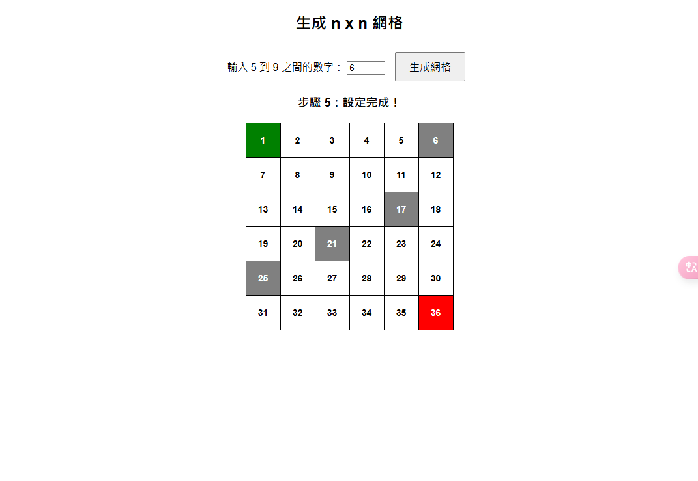

# HW1-1 
# Flask 網格地圖開發

## 簡介
使用 Flask 框架實作一個網格地圖應用程式，允許使用者設定起點、終點及障礙物，並透過 API 產生隨機的策略與數值表。

## 目標功能
- 允許使用者設定 5x5 至 9x9 的網格大小。
- 使用者可點擊網格設定起點、終點及障礙物。

## 環境需求
- Python 3
- Flask
- NumPy

## 主要程式碼

### `app.py`
該檔案負責處理後端邏輯，包含 Flask 路由與 API。

#### 1. 導入必要套件
```python
from flask import Flask, render_template, request, jsonify
import numpy as np
import random
```

#### 2. 初始化 Flask 應用
```python
app = Flask(__name__)
```

#### 3. 定義全域變數
```python
grid_size = 5
start_cell = None
end_cell = None
obstacles = set()
```

#### 4. 主要路由
- **首頁 (`/`)**：回傳 `index.html`。
- **設定網格大小 (`/set_grid_size`)**：使用者可輸入 5 至 9 之間的數字來改變網格大小。
- **設定網格內的格子 (`/set_cell`)**：允許使用者設定起點、終點及障礙物。

### `index.html`
該檔案負責顯示網頁介面，讓使用者互動設定網格。

#### 1. HTML 結構
- 提供輸入框讓使用者輸入網格大小。
- 透過 JavaScript 動態生成網格。
- 允許使用者點擊設定起點、終點與障礙物。

#### 2. CSS 樣式
```css
.start { background-color: green; color: white; }
.end { background-color: red; color: white; }
.obstacle { background-color: gray; color: white; }
```

#### 3. JavaScript 互動功能
- **`generateGrid()`**：根據使用者輸入的數值產生網格。
- **`handleCellClick(cell)`**：讓使用者點擊設定起點、終點與障礙物。
- **`updateInstruction()`**：更新目前的步驟指示。

## 執行方式
1. 安裝 Flask
   ```sh
   pip install flask numpy
   ```
2. 啟動應用程式
   ```sh
   python app.py
   ```
3. 在瀏覽器開啟 `http://127.0.0.1:5000/`，開始使用應用程式。

## 執行結果





# HW1-2
# 策略評估網格（Policy Evaluation Grid）

## 功能介紹
### 1. 生成網格（Grid）
- 使用者可輸入 **5 到 9 之間的數字** 來決定網格大小，然後點擊 **「生成網格」** 按鈕建立網格。
- 網格中的每個單元格代表一個 **狀態（State）**。
- 使用者可點擊單元格來設定 **起點、終點與障礙物**。

### 2. 策略矩陣（Policy Matrix）
- 設定好起點、終點與障礙物後，點擊 **「生成 Policy Matrix」** 來隨機為可移動的格子分配方向（↑ ↓ ← →）。
- 箭頭代表智能體在該狀態下的行為選擇。

### 3. 策略評估（Policy Evaluation）
- 設定好策略後，點擊 **「策略評估」** 來計算每個狀態的價值（Value Function）。
- 計算方式採用 **貝爾曼方程（Bellman Equation）**，根據折扣因子（Gamma）來更新價值網格，直至收斂。
- **價值評估結果** 會顯示在右側的表格，每個單元格的數值代表該狀態的長期回報。

## 技術細節
### **策略評估（Policy Evaluation）**
- 透過遞迴計算：
  ```math
  V(s) = R(s) + \gamma \sum P(s' | s, a) V(s')
  ```
  來估計每個狀態的長期回報。
- **終點** 具有較高的獎勵值（+10）。
- **一般移動** 會有小懲罰（-1）。
- **嘗試移動到牆壁或障礙物** 會受到額外懲罰（-5）。

### **策略選擇（Policy Generation）**
- 隨機分配四個方向（↑ ↓ ← →）。
- 避免起點的箭頭都指向起點
- 避免終點的箭頭都不指向起點

## 執行結果


