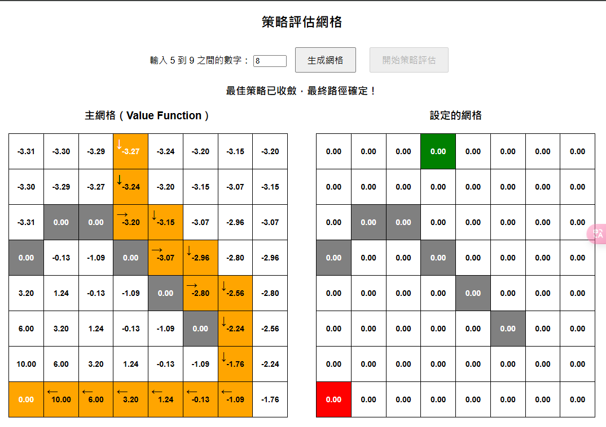

# HW2 

本系統是一個基於 Flask 的網格策略評估平台，結合前端 HTML/JavaScript 與後端 Python 來展示利用 **Value Iteration（價值迭代）** 演算法在一個離散的網格環境中計算最佳策略，並模擬從起點到終點的最優路徑。以下將詳細介紹系統各部份的功能、流程與技術實現細節。

---

## 系統架構概述

系統分為兩大部分：

- **前端 (HTML/JavaScript)：**  
  用戶透過網頁設定網格大小，並依次選擇起點、終點與障礙物。前端負責生成與更新網格視覺化介面，並利用 AJAX 與後端進行資料交換，根據後端回傳的模擬結果來刷新畫面顯示。

- **後端 (Flask/Python)：**  
  負責存取網格狀態（包括大小、起點、終點、障礙物）、管理模擬狀態（value function、追蹤路徑、模擬位置）以及執行價值迭代與路徑模擬的計算邏輯。透過 REST API 將最新狀態回傳給前端更新畫面。

---

## 主要功能詳解

### 1. 網格生成與狀態設定

- **網格大小設定：**  
  使用者可以輸入介於 5 到 9 的數字，決定網格的行與列數。前端檢查輸入數字的合法性後，呼叫後端 API `/set_grid_size`，後端則初始化網格及模擬變數。

- **狀態設定（起點、終點、障礙物）：**  
  - **起點設定：** 點擊網格中的一個格子，該格將標記為起點（綠色），並透過 API `/set_cell` 告知後端。
  - **終點設定：** 選定起點後，再點擊一個非起點格子，將其標記為終點（紅色）。
  - **障礙物設定：** 最後選擇 `gridSize - 2` 個障礙物（灰色），以確保有足夠的可行動空間。系統透過 BFS（廣度優先搜尋）檢查前端網格中是否仍存在從起點到終點的連通路徑，不符則提醒使用者重新選擇障礙物。

### 2. 前端顯示與互動

- **主網格與價值網格：**  
  前端生成兩個區域：
  - **主網格：** 用於顯示每個狀態的 value function（V(s)）數值，並用來標記模擬過程（追蹤中的格子用黃色，最終路徑用橙色）。
  - **右側價值網格：** 單獨顯示所有狀態的 V(s) 數值，方便用戶查看每個狀態的期望回報。

- **視覺標記與箭頭：**  
  - 在模擬過程中，當前追蹤的格子以黃色標記，表示目前最佳路徑正在擴展中。
  - 當模擬完成（即追蹤路徑抵達終點）時，整條路徑以橙色標記。除了起點與終點外，每個格子上會顯示一個箭頭，箭頭根據相鄰格子的相對位置（上、下、左、右）來決定顯示方向，從而直觀地展示最佳策略。

- **用戶操作流程：**  
  1. 用戶輸入網格大小，點選「生成網格」。
  2. 按照提示依序選擇起點、終點、障礙物。
  3. 當設定完成後，啟用「開始策略評估」按鈕，開始模擬。

### 3. 後端模擬與 Value Iteration

- **初始化模擬狀態：**  
  當網格大小或狀態改變時，後端會初始化以下變數：
  - **`value_grid`：** 一個二維列表，用於儲存每個狀態的 V(s) 值，初始均設為 0。
  - **`tracking_pos` 與 `tracking_path`：** 分別記錄當前模擬所在位置以及從起點到目前位置的追蹤路徑。
  - **`simulation_finished`：** 標記模擬是否完成，即是否走到終點。

- **價值迭代算法：**  
  後端的 `/simulate_step` API 會執行以下操作：
  1. **Value Iteration 更新：**  
     依據 Bellman 方程，對每個非障礙物且非終點的狀態更新 V(s)：
     其中：
     - r(s, a) 為立即獎勵（一般為 -1，若移動至終點則為 10，若碰到障礙或出界則為 -5）。
     - gamma 為折扣因子（設定為 0.7）。

  2. **模擬移動：**  
     從當前追蹤位置出發，檢查四個鄰近格的 Q-value，選擇 Q-value 最高的作為下一步移動。如果移動後的位置為終點，則設定模擬結束。

  3. **最終路徑箭頭計算：**  
     當模擬完成後，根據記錄的追蹤路徑，計算每個非終點格的箭頭方向，告知前端在該格顯示移動方向。

- **迭代流程：**  
  前端每秒調用一次 `/simulate_step` API，獲取最新的 `value_grid`、`tracking_path` 與是否完成的標記。前端根據這些資料刷新網格顯示。

### 4. 前後端 API 交互

- **`/set_grid_size` API：**  
  接收前端設定的網格大小，初始化全域變數（包括 `value_grid` 與模擬狀態）。

- **`/set_cell` API：**  
  接收用戶選擇的格子資訊（起點、終點或障礙物），並更新後端的全域變數，確保後端模擬狀態與前端顯示同步。

- **`/simulate_step` API：**  
  核心模擬 API，每次呼叫都會：
  - 更新 value function。
  - 根據更新後的數值與當前追蹤位置計算下一步。
  - 返回最新的 `value_grid`、`tracking_path`、模擬是否完成的狀態，以及最終路徑上各格顯示箭頭資料（若模擬完成）。

## 執行結果

### 螢幕截圖：

### DEMO 影片連結：
[點此下載觀看 DEMO.mp4](Result/DEMO.mp4)
