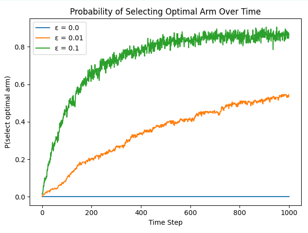
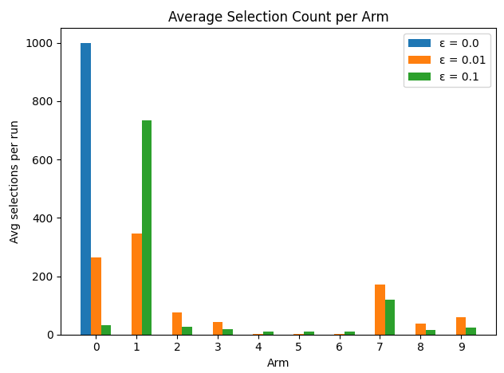

# $\varepsilon$-貪婪演算法 (Epsilon-Greedy)

## 算式

在第 $t$ 步，對於每個臂 $i$，動作選擇為：

$$
A_t =
\begin{cases}
  \arg\max_{i}\,\hat{\mu}_i(t), & \text{以機率 } 1 - \varepsilon, \\
  \text{從 }\{1,2,\dots,K\}\text{ 隨機選擇一臂}, & \text{以機率 } \varepsilon.
\end{cases}
$$


## 解釋
- $\hat{\mu}_i(t)$ 是臂 $i$ 在前 $t-1$ 步的樣本平均獎勵。
- 參數 $\varepsilon$：控制「探索 (Exploration)」與「利用 (Exploitation)」之間的權衡。
- **利用 (Exploitation)**：以機率 $1 - \varepsilon$ 選擇當前 $\hat{\mu}_i(t)$ 最大的臂，充分利用已知資訊。
- **探索 (Exploration)**：以機率 $\varepsilon$ 隨機選擇任何臂，探索其他臂的潛在價值。
- 若 $\varepsilon$ 過大，過度探索導致短期獎勵不足；若 $\varepsilon$ 過小，可能陷入次優解。

## 適合應用

- 線上廣告推薦：根據歷史點擊率 $\hat{\mu}_i$ 動態調整展示頻次，並以機率 $\varepsilon$ 推薦新廣告。
- A/B 測試：根據方案轉換率 $\hat{\mu}_i$ 決定主推方案，並偶爾以機率 $\varepsilon$ 測試新方案。
- 遊戲智能代理：在回合制遊戲中根據估計獎勵 $\hat{\mu}_i$ 選擇動作，並探索未知動作。
- 推薦系統：動態推薦物品或內容，並以機率 $\varepsilon$ 嘗試新物品以更新使用者偏好。

## 圖形分析

### 圖 1：最優臂選擇機率隨時間變化


在「Probability of Selecting Optimal Arm Over Time」圖中，可以觀察到：
- $\varepsilon = 0.0$（純利用）幾乎不會探索，一旦選錯臂（首次可能非最優臂），後續選最優臂的機率維持在 0。
- $\varepsilon = 0.01$ 以較低探索率逐步發現最優臂，P(select optimal arm) 從 0 緩慢上升，最終約收斂到 0.5 左右。
- $\varepsilon = 0.1$ 以較高探索率快速辨識最優臂，P(select optimal arm) 在前 200 步已接近 0.7–0.8，並在後期穩定。

### 圖 2：每臂平均被選次數


在「Average Selection Count per Arm」圖中，可以看到：
- $\varepsilon = 0.0$ 完全鎖定初始被認為最優的臂（臂 0），總選擇次數 1000。
- $\varepsilon = 0.01$ 主要集中在真實最優的臂（臂 1）約 340 次，其餘臂皆有少量探索。
- $\varepsilon = 0.1$ 仍以臂 1 為主（約 740 次），但其他臂的探索次數也相對增加，顯示更均衡的探索分配。

## ChatGPT 提示語

以下是一個範例提示，可用於讓 ChatGPT 協助分析 $\varepsilon$-貪婪演算法的結果圖：

```
假設你是一位機器學習專家，請根據以下資訊協助分析 ε-貪婪演算法的行為：
1. 算法設定：臂數 K = 10，真實獎勵機率隨機生成，ε 分別為 0.0、0.01、0.1。
2. 圖表：
   - Probability of Selecting Optimal Arm Over Time
   - Average Selection Count per Arm
請說明：
- 不同 ε 值如何影響對最優臂的辨識速度與資源分配。
- 圖中呈現的關鍵現象與背後原因。
- 若要優化此算法，可採取哪些改進策略？
```

