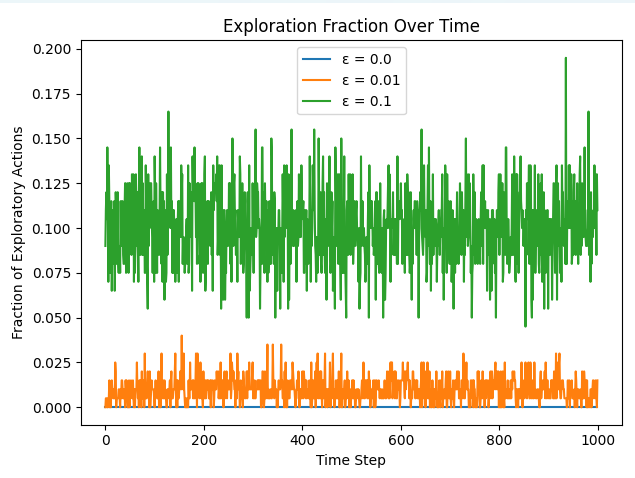

# ε-貪婪演算法 (Epsilon-Greedy)

## 算式

在第 $t$ 步，對於每個臂 $i$，動作選擇為：

$$
A_t =
\begin{cases}
  \arg\max_{i}\,\hat{\mu}_i(t), & \text{以機率 } 1 - \varepsilon, \\
  \text{從 }\{1,2,\dots,K\}\text{ 隨機選擇一臂}, & \text{以機率 } \varepsilon.
\end{cases}
$$


## 解釋
- 其中，$\hat{\mu}_i(t)$ 是臂 $i$ 在前 $t-1$ 步的樣本平均獎勵。
- 參數 $\varepsilon$：控制「探索 (Exploration)」與「利用 (Exploitation)」之間的權衡。
- **利用 (Exploitation)**：以機率 $1 - \varepsilon$ 選擇當前 $\hat{\mu}_i(t)$ 最大的臂，充分利用已知資訊。
- **探索 (Exploration)**：以機率 $\varepsilon$ 隨機選擇任何臂，探索其他臂的潛在價值。
- 若 $\varepsilon$ 過大，過度探索導致短期獎勵不足；若 $\varepsilon$ 過小，可能陷入次優解。

## 適合應用

- 線上廣告推薦：根據歷史點擊率 $\hat{\mu}_i$ 動態調整展示頻次，並以機率 $\varepsilon$ 推薦新廣告。
- A/B 測試：根據方案轉換率 $\hat{\mu}_i$ 決定主推方案，並偶爾以機率 $\varepsilon$ 測試新方案。
- 遊戲智能代理：在回合制遊戲中根據估計獎勵 $\hat{\mu}_i$ 選擇動作，並探索未知動作。
- 推薦系統：動態推薦物品或內容，並以機率 $\varepsilon$ 嘗試新物品以更新使用者偏好。

## 額外圖形分析

### 圖 1：平均累積回報


在「Average Cumulative Reward Over Time」圖中：
- 不同 $\varepsilon$ 值的曲線斜率反映了長期累積回報效率。
- $\varepsilon=0.1$ 最快累積回報（線性最陡），因為及早探索找到最優臂後持續利用。
- $\varepsilon=0.01$ 次之，斜率介於二者之間。
- $\varepsilon=0.0$ （純利用）如果首選非最優臂，則累積回報最差。

### 圖 2：平均即時回報


在「Average Instantaneous Reward Over Time」圖中：
- $\varepsilon=0.1$ 初期波動後快速提升至高水準（約 0.9），穩定最大化即時收益。
- $\varepsilon=0.01$ 上升速度較慢，需較長時間收斂至最佳區間。
- $\varepsilon=0.0$ 平均獲得獎勵約 0.4 左右，因為鎖定了次優臂。

### 圖 3：探索比例


在「Exploration Fraction Over Time」圖中：
- 曲線約在理論值附近振盪：$\varepsilon=0.1$ 約 10%、$\varepsilon=0.01$ 約 1%、$\varepsilon=0.0$ 永遠為 0。
- 這反映了演算法中「隨機探索」機制的真實執行比例。

## ChatGPT 提示語

```
假設你是一位機器學習專家，請根據以下資訊協助分析 ε-貪婪演算法的核心表現：
1. 算法設定：臂數 K = 10，真實獎勵機率隨機生成，ε 分別為 0.0、0.01、0.1。
2. 圖表：
   - Average Cumulative Reward Over Time
   - Average Instantaneous Reward Over Time
   - Exploration Fraction Over Time
請綜合說明：
- 各 ε 下累積回報與即時回報的差異與原因。
- 探索比例如何影響回報曲線。
- 若要在新場景中選擇 ε，可參考哪些準則？
```

