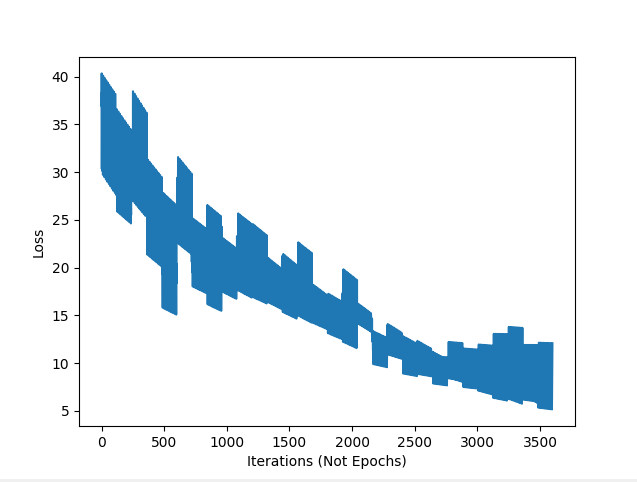
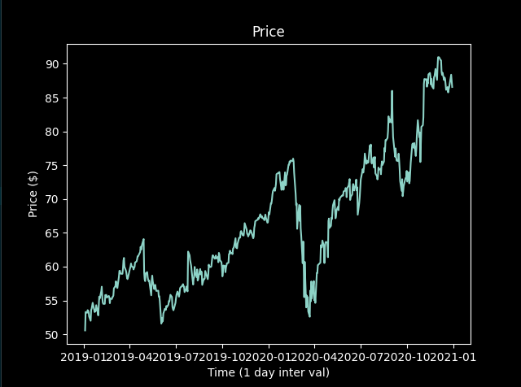
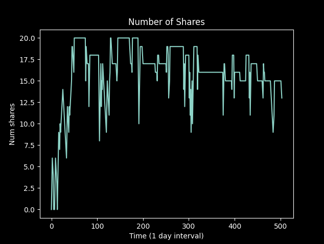
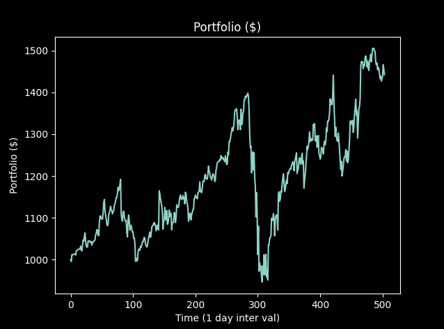
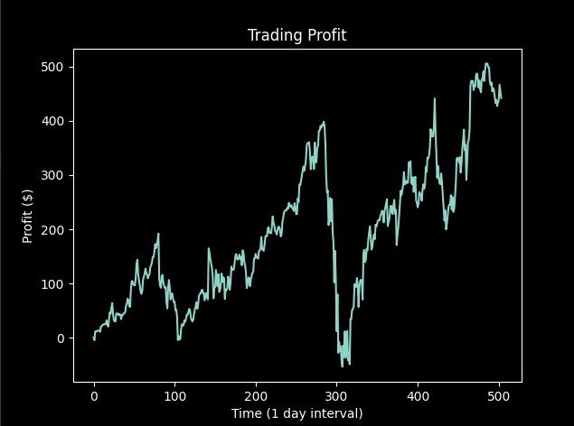
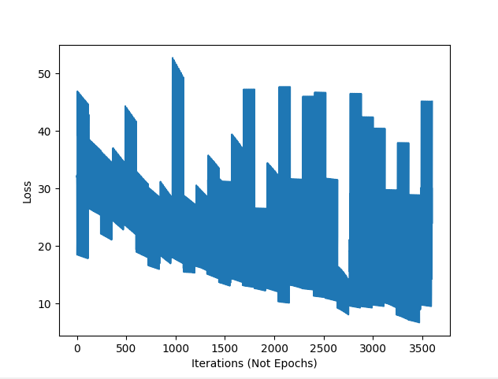
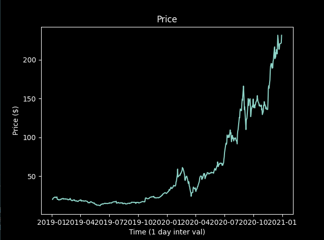
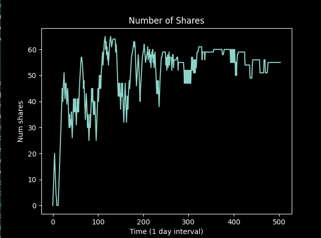
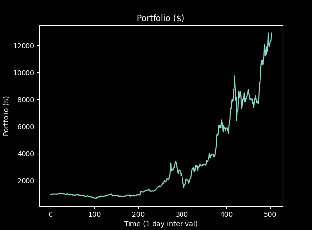
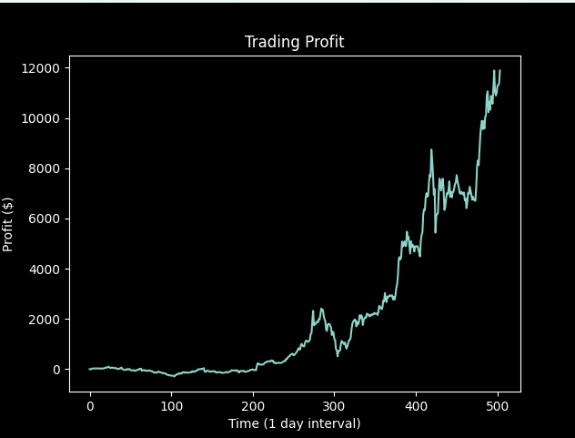

# 論文 https://paperswithcode.com/paper/agent-performing-autonomous-stock-trading
# 論文程式碼 https://github.com/yunfeiluo/autonomous-stock-trading
# Chatgpt 筆記 https://chatgpt.com/share/6830305e-0a10-800a-be79-784c9c4193d5

# 執行程式碼 (run.py): GOOG 交易策略分析報告

先使用 data_preprocessing.py 進行資料的抓取
以下以 GOOG（Google）為例，對實驗中繪製的五張主要圖片進行逐一說明與分析。

---

## Figure 1：Loss vs. Iterations (Not Epochs)

- **說明**  
  - 橫軸為訓練迭代次數（Iterations），而非完整 Epoch。  
  - 縱軸為神經網路在 Q-learning 中所計算的 Huber loss 值。
- **觀察**  
  1. 初始損失約在 35–40 之間，明顯較高。  
  2. 損失隨迭代快速下降，約在 2,500 次後趨於平緩，最終在 5–12 區間波動。  
  3. 曲線中的鋸齒狀振盪反映了每次 batch 更新帶來的隨機波動，但整體趨勢為穩定下降。  
- **意義**  
  - 模型能在相對短的訓練迭代內收斂到較低的預測誤差，代表 Q-network 成功學習到對「買賣動作」的價值估計。  
  - 振盪幅度縮小，說明網路更新已進入微調階段。

---

## Figure 2：GOOG 股價走勢 (2019–2021)

- **說明**  
  - 橫軸顯示從 2019 年初到 2021 年初的交易日 (1-day interval)。  
  - 縱軸為 GOOG 的每日收盤價（美元）。
- **觀察**  
  1. 2019–2020 年初呈穩健上漲趨勢，由 \$52 漲至約 \$75。  
  2. 2020 年 2–3 月出現明顯跌幅（受疫情利空影響），最低回落至約 \$54。  
  3. 跌後快速反彈，並於 2020 年下半年續創新高，接近 \$90。
- **意義**  
  - 價格走勢分為「上升期」與「劇烈回調期」，為測試模型在不同市場環境下的表現提供基準。

---

## Figure 3：持股張數 (Number of Shares)

- **說明**  
  -橫軸同為時間 (1-day interval)，縱軸為模型倉位（持有股數）。
- **觀察**  
  1. 初期模型快速建倉，約在 100 天內持股量攀升至 ~20 股。  
  2. 在價格回調期間（約 250–300 天），持股量有大幅降至 10 股以下，甚至一度清倉。  
  3. 隨後反彈期再次加倉，穩定在 15–20 股區間。
- **意義**  
  - 演算法會根據市場訊號自動調整倉位：在上漲趨勢中加大持倉，遇到急跌則快速減倉以控制風險。

---

## Figure 4：投資組合價值 (Portfolio Value)

- **說明**  
  - 橫軸為交易日，縱軸為現金 + 持股市值的總和（美元）。
- **觀察**  
  1. 組合價值從 \$1,000 緩慢上升，至 ~\$1,180（約 180 天）。  
  2. 在 250–300 天跌幅中，組合價值一度降至 ~\$960。  
  3. 跌後反彈快速，最終回升至 ~\$1,450 左右。
- **意義**  
  - 演算法在跌勢中對組合價值的保護能力一般，但在反彈期能有效捕捉上漲空間，最終仍實現正向增長。

---

## Figure 5：單日交易盈虧累計 (Trading Profit)

- **說明**  
  - 橫軸為交易日，縱軸為到該日為止的累積交易利潤（美元）。
- **觀察**  
  1. 累積利潤在早期穩定攀升，至 ~\$180。  
  2. 在中期市場大跌中出現負利潤 (–\$50 左右)；表示模型在極端波動環境下仍發生虧損。  
  3. 反彈期利潤快速回升並超越高峰，最終達到 ~\$480。
- **意義**  
  - 演算法整體具有賺錢能力，但在劇烈下跌過程中未完全避險；未來可考慮加入風控機制如止損或動態調整交易頻率。

---

## 總結

1. **收斂行為**（Figure 1）良好，模型在數千次迭代後達到穩定低 loss。  
2. **策略選擇**（Figures 3–5）能夠在上漲趨勢期大幅加倉並擴大收益，但在急跌時暴露一定虧損風險。  

---

# 執行程式碼 (run.py): TSLA 交易策略分析報告

先使用 data_preprocessing.py 進行資料的抓取
以下以 TSLA 為例，對實驗中繪製的五張主要圖片進行逐一說明與分析。

---

## Figure 1：Loss vs. Iterations (Not Epochs)

- **說明**  
  - 橫軸為訓練迭代次數（Iterations），非完整 Epoch。  
  - 縱軸為 Q-network 計算出的 Huber loss 值。  
- **觀察**  
  1. 初始 loss 約在 45–55 之間，高於 GOOG 的起點，反映 TSLA 波動更劇烈。  
  2. Loss 隨迭代快速下降，到約 2,500 次後進入微調階段，最終在 8–15 區間震盪。  
  3. 曲線鋸齒狀振盪來自於每次 batch 更新的不穩定性，但整體趨勢明顯向下。  
- **意義**  
  - 模型能在高波動標的上收斂，但相較平穩標的需要更多迭代或額外正則化以抑制振盪。

---

## Figure 2：TSLA 股價走勢 (2019–2021)

- **說明**  
  - 橫軸：2019 年初至 2021 年初的交易日（1-day interval）。  
  - 縱軸：TSLA 每日收盤價（美元）。  
- **觀察**  
  1. 2019 年盤整於約 \$20–\$25。  
  2. 2020 上半年急速攀升，6 月突破 \$50，7–8 月短暫回調至 \$30–\$35。  
  3. 下半年續創新高，年底前衝上 \$230。  
- **意義**  
  - TSLA 價格強烈上漲且劇烈波動，對策略的動態倉位調整能力構成高要求。

---

## Figure 3：持股張數 (Number of Shares)

- **說明**  
  - 橫軸：交易日；縱軸：策略持有 TSLA 股數。  
- **觀察**  
  1. 初期少量建倉，50 天內增至 30–40 股。  
  2. 隨後在強勢上漲期最高加倉至 65–70 股。  
  3. 回調時減至 45 股左右，回彈後維持在 50–60 股區間。  
- **意義**  
  - 模型會隨趨勢放大倉位，在急跌中及時減倉，有基本風控效果。

---

## Figure 4：投資組合價值 (Portfolio Value)

- **說明**  
  - 橫軸：交易日；縱軸：現金 + 持股市值總和（美元）。  
- **觀察**  
  1. 組合價值從 \$1,000 緩升至 \$1,200 （約 150 天）。  
  2. TSLA 飆漲期推升至 \$3,000 （約 280 天），中途回撤至 \$2,500 左右。  
  3. 最終衝高至 \$12,800 以上，總漲幅超過 12 倍。  
- **意義**  
  - 策略在強勢標的上放大收益顯著，但中途回撤亦較深。

---

## Figure 5：單日交易盈虧累計 (Trading Profit)

- **說明**  
  - 橫軸：交易日；縱軸：累積交易利潤（美元）。  
- **觀察**  
  1. 初期利潤波動小，直到第 100 天後開始轉正。  
  2. 中期 TSLA 飆升帶來利潤快速增長，最高累積利潤達 \$8,500 左右。  
  3. 最終累積利潤約 \$12,000，即使中途因減倉出現小幅虧損。  
- **意義**  
  - 策略整體盈利能力強，能大幅捕捉 TSLA 上漲動能，但仍可優化風險控制。

---

## 總結與建議

1. **收斂穩定性**  
   - 高波動標的收斂速度較慢，可考慮 Double DQN、Dueling DQN 或調整 target network 更新頻率。  
2. **風險管理**  
   - 增設止損/止盈規則，或在回調訊號明確時自動降低持股比例。  

